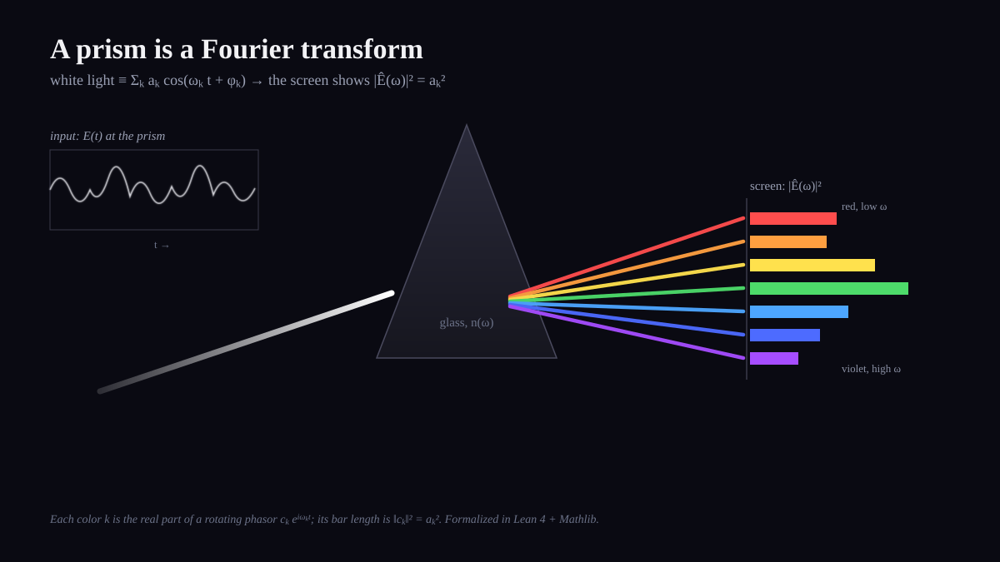

# A Lean proof of "Dark Side of the Moon"

A small, fully machine-checked Lean 4 + Mathlib formalization of the physics behind
the famous prism image: **white light is a sum of frequencies (a Fourier
decomposition), a prism sends each frequency to a different angle, and the screen
shows the Fourier spectrum `|Ê(ω)|²`.**



> *The diagram above is an original illustration created for this project
> ([`docs/prism-fourier.svg`](docs/prism-fourier.svg), released CC0).* The actual
> *Dark Side of the Moon* album cover (designed by Storm Thorgerson / Hipgnosis) is
> **not** reproduced here, out of respect for its copyright. Pink Floyd and the album
> are referenced by name only.

---

## What is actually proved

Everything lives in [`DarkSide/Basic.lean`](DarkSide/Basic.lean). A *spectrum* is a
finite family of modes, each with a real amplitude `aₖ`, angular frequency `ωₖ`, and
phase `φₖ`.

| Result | Statement | Panel |
|---|---|---|
| `signal` | `E(t) = ∑ₖ aₖ · cos(ωₖ t + φₖ)` | ① light is a sum of cosines |
| `phasor` | `Ê(ωₖ) = aₖ · e^{i φₖ}` | the complex Fourier amplitude of a mode |
| `intensity` | `‖Ê(ωₖ)‖² = aₖ²` | ③ the screen shows `|Ê|²` |
| `mode_reconstruction` | `Re(cₖ · e^{i ωₖ t}) = aₖ · cos(ωₖ t + φₖ)` | one color, from its phasor |
| `signal_eq_sum_phasors` | `E(t) = Re(∑ₖ cₖ · e^{i ωₖ t})` | ① ⇄ ③ the whole beam |

### The idea

Each cosine mode is the real part of a rotating complex phasor:

```
aₖ · e^{i φₖ} · e^{i ωₖ t}   ⟶   Re(·) = aₖ · cos(ωₖ t + φₖ)
```

- **`mode_reconstruction`** combines the two exponentials (`e^{iφ}·e^{iωt} = e^{i(ωt+φ)}`)
  and takes the real part, giving back the cosine — via Euler's formula.
- **`intensity`** computes the squared modulus of the phasor: `‖aₖ e^{iφₖ}‖² = aₖ²`,
  because `‖e^{iφ}‖² = cos²φ + sin²φ = 1`. That number is the length of the bar on
  the screen — the Fourier spectrum.
- **`signal_eq_sum_phasors`** sums the modes: the entire light signal is the real
  part of the sum of its rotating Fourier phasors. This is panel ① and panel ③ being
  the same object, seen two ways.

### Statement in Lean

```lean
/-- Panel 3 (the screen): the intensity of mode k is |Ê(ωₖ)|² = aₖ². -/
theorem intensity (S : Spectrum n) (k : Fin n) :
    Complex.normSq (phasor S k) = (S.amp k) ^ 2

/-- The whole signal is the real part of the sum of its rotating Fourier phasors. -/
theorem signal_eq_sum_phasors (S : Spectrum n) (t : ℝ) :
    signal S t
      = (∑ k, phasor S k * Complex.exp ((S.freq k : ℂ) * (t : ℂ) * Complex.I)).re
```

---

## Verifying it yourself

Requires [`elan`](https://github.com/leanprover/elan) (the Lean toolchain manager).
The pinned toolchain (`lean-toolchain`) and Mathlib revision (`lake-manifest.json`)
are checked in.

```bash
# fetch the prebuilt Mathlib cache (avoids compiling Mathlib from source)
lake exe cache get

# build — a clean build with no errors means every theorem is proved
lake build
```

A theorem is only proved when the build reports no errors **and** no
`declaration uses 'sorry'` warning. This project has neither.

### Independent certification

Every declaration in `DarkSide.Basic` was additionally re-checked by
[Tenet](https://leanstudio.dev), an independent Lean kernel:

```
Tenet checked 19 declarations in 1 module (Lean 4.34.1):
  19 verified, 0 resting on an assumption, 0 rejected.
```

No `sorry`, no project-introduced axioms — only Lean/Mathlib's standard foundations.

---

## Scope, honestly

This is the **finite-sum** Fourier statement — the "seven components shown" in the
diagram — which is completely faithful to the picture and fully provable with elementary
means. The genuinely *continuous* claim ("any signal decomposes into a continuum of
frequencies") requires integral Fourier transforms and is a much larger undertaking;
it is not attempted here. Panel ② (Snell's law → dispersion, "higher ω bends more") is
also not yet formalized.

## License / attribution

Lean source released under the Apache 2.0 license. "Dark Side of the Moon" is an album
by Pink Floyd; its title and cover artwork are the property of their respective rights
holders and are not reproduced in this repository.
